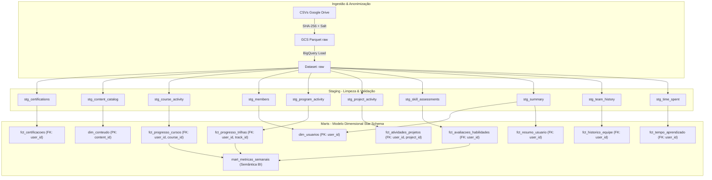

# Catálogo de Dados & Dicionário de Schemas — BigQuery Data Catalog

Este documento consolida a documentação técnica e de negócio de todas as tabelas e campos do Data Lake `gem-dados`, cobrindo as camadas `raw`, `staging` e `marts`.

As anotações estruturadas presentes nos arquivos `.sqlx` do Dataform (`description:` e `columns: { ... }`) são sincronizadas automaticamente com o **Google Cloud Data Catalog / Dataplex** e os metadados nativos do **Google BigQuery**.

---

## 1. Visão Geral da Arquitetura de Dados

---

## 2. Conformidade LGPD & Política de Anonimização

- **Chave Primária/Estrangeira Universal:** Todos os dados de alunos utilizam `user_id`, calculado como `SHA256(email || SALT)`. O SALT é gerido no GCP Secret Manager e restrito aos jobs de ingestão.
- **Auditoria de PII (Task 2.7):**
  - Campos `firstname`, `lastname`, `name`, `username`, `email` e `useremail` foram **100% eliminados** das camadas analíticas (`staging` e `marts`).
  - Nenhuma informação de identificação pessoal direta reside nos datasets acessíveis pelo BI (`marts`).

---

## 3. Dicionário de Tabelas da Camada MARTS (Consumo Analítico & BI)

### 3.1 `marts.dim_usuarios`
- **Descrição:** Dimensão cadastral e situacional de usuários/alunos da plataforma.
- **Grão:** 1 linha por aluno (`user_id`).
- **Chave Primária:** `user_id` (STRING, NOT NULL, UNIQUE).

| Coluna | Tipo BigQuery | Chave | Descrição |
|---|---|---|---|
| `user_id` | STRING | **PK** | Identificador único anonimizado do aluno (SHA-256) |
| `teams` | STRING | | Turmas ou equipes às quais o aluno pertence |
| `role` | STRING | | Papel cadastrado do aluno (ex: student, admin) |
| `learn_license` | STRING | | Licença de aprendizado ativa |
| `workspace_license` | STRING | | Licença de workspace ativa |
| `dateuserjoinedgroup` | TIMESTAMP | | Timestamp de entrada no grupo/plataforma |
| `dateuserleftgroup` | TIMESTAMP | | Timestamp de saída/desligamento do grupo (se houver) |
| `user_status` | STRING | | Status operacional ('active' ou 'inactive') |
| `totalxp` | INT64 | | Pontos de experiência (XP) totais acumulados |
| `dateoflastxpearned` | TIMESTAMP | | Timestamp da última atividade com ganho de XP |

---

### 3.2 `marts.dim_conteudo`
- **Descrição:** Catálogo unificado de cursos, trilhas, projetos e avaliações.
- **Grão:** 1 linha por conteúdo (`content_id`).
- **Chave Primária:** `content_id` (STRING, NOT NULL, UNIQUE).

| Coluna | Tipo BigQuery | Chave | Descrição |
|---|---|---|---|
| `content_id` | STRING | **PK** | Identificador único do conteúdo no catálogo |
| `type` | STRING | | Tipo do conteúdo (course, track, project, assessment) |
| `title` | STRING | | Título oficial do conteúdo |
| `description` | STRING | | Descrição detalhada da ementa |
| `url` | STRING | | URL de acesso ao conteúdo |
| `technology` | STRING | | Tecnologia principal associada (ex: Python, SQL, R, Power BI) |
| `topic` | STRING | | Tópico temático do aprendizado |
| `skill_level` | STRING | | Nível de dificuldade exigido (Beginner, Intermediate, Advanced) |
| `hours` | FLOAT64 | | Carga horária estimada em horas |
| `state` | STRING | | Estado de publicação do conteúdo |
| `mobile` | BOOL | | Compatibilidade mobile |
| `releasedat` | TIMESTAMP | | Data de lançamento do conteúdo |
| `lastupdatedat` | TIMESTAMP | | Data da última atualização |

---

### 3.3 `marts.fct_progresso_cursos`
- **Descrição:** Tabela Fato de progresso, atividade e conclusão de cursos por aluno.
- **Grão:** 1 linha por aluno (`user_id`) e curso (`course_id`).
- **Chave Única:** `(user_id, course_id)`.

| Coluna | Tipo BigQuery | Chave | Descrição |
|---|---|---|---|
| `user_id` | STRING | **FK** | Identificador do aluno (relaciona com `dim_usuarios`) |
| `course_id` | INT64 | **FK** | Identificador do curso (relaciona com `dim_conteudo`) |
| `coursename` | STRING | | Nome completo do curso |
| `technology` | STRING | | Tecnologia principal do curso |
| `startedcourse` | TIMESTAMP | | Timestamp de início do curso pelo aluno |
| `finishedcourse` | TIMESTAMP | | Timestamp de conclusão do curso |
| `duration_minutes` | INT64 | | Duração calculada em minutos entre início e conclusão |
| `skippedcourse` | STRING | | Indicação se o curso foi pulado |
| `lastvisitedcourse` | TIMESTAMP | | Timestamp do último acesso |
| `completedcourseexercises` | INT64 | | Exercícios concluídos no curso |
| `coursecompletionrate` | FLOAT64 | | Taxa percentual de conclusão (0 a 1) |
| `coursestatus` | STRING | | Status (completed, in_progress, not_started) |
| `is_completed` | BOOL | | Booleano indicando conclusão do curso |
| `totalcoursexpearned` | INT64 | | XP ganho no curso |
| `totalcoursexpavailable` | INT64 | | Total de XP disponível no curso |
| `xpscore` | FLOAT64 | | Score de aproveitamento |
| `coursestate` | STRING | | Estado do curso |

---

### 3.4 `marts.fct_progresso_trilhas`
- **Descrição:** Tabela Fato de progresso e conclusão em trilhas/programas de aprendizagem.
- **Grão:** 1 linha por aluno (`user_id`) e trilha (`track_id`).
- **Chave Única:** `(user_id, track_id)`.

| Coluna | Tipo BigQuery | Chave | Descrição |
|---|---|---|---|
| `user_id` | STRING | **FK** | Identificador do aluno |
| `track_id` | INT64 | **FK** | Identificador numérico da trilha |
| `trackversionid` | INT64 | | Versão da trilha |
| `tracktitle` | STRING | | Título oficial da trilha |
| `technology` | STRING | | Tecnologia principal da trilha |
| `startedat` | TIMESTAMP | | Timestamp de início na trilha |
| `completedat` | TIMESTAMP | | Timestamp de conclusão da trilha |
| `duration_days` | INT64 | | Duração calculada em dias |
| `pct_xp_earned` | INT64 | | Percentual de XP conquistado |
| `hours_spent` | FLOAT64 | | Horas investidas na trilha |
| `numcourses` | INT64 | | Total de cursos da trilha |
| `numcoursescompleted` | INT64 | | Cursos concluídos na trilha |
| `is_completed` | BOOL | | Booleano indicando se a trilha foi concluída |
| `numchapters` | INT64 | | Total de capítulos na trilha |
| `numchapterscompleted` | INT64 | | Capítulos concluídos |
| `numprojects` | INT64 | | Total de projetos na trilha |
| `numprojectscompleted` | INT64 | | Projetos concluídos |
| `numassessments` | INT64 | | Total de avaliações na trilha |
| `numassessmentscompleted` | INT64 | | Avaliações concluídas |

---

### 3.5 `marts.fct_avaliacoes_habilidades`
- **Descrição:** Tabela Fato de tentativas de avaliações de competência técnica.
- **Grão:** 1 linha por tentativa do aluno em uma avaliação (`user_id`, `assessment_slug`, `attempt_number`).

| Coluna | Tipo BigQuery | Chave | Descrição |
|---|---|---|---|
| `user_id` | STRING | **FK** | Identificador do aluno |
| `assessment_name` | STRING | | Nome da avaliação |
| `assessment_slug` | STRING | | Slug/código da avaliação |
| `attempt_number` | INT64 | | Número sequencial da tentativa |
| `date_started` | TIMESTAMP | | Timestamp de início da avaliação |
| `date_completed` | TIMESTAMP | | Timestamp de término |
| `duration_minutes` | INT64 | | Duração em minutos |
| `reported_score` | INT64 | | Pontuação obtida na avaliação |
| `reported_percentile` | INT64 | | Percentil de desempenho |
| `reported_knowledge_level` | STRING | | Nível de proficiência (Beginner, Intermediate, Advanced) |
| `is_proficient` | BOOL | | Flag booleana indicando se atingiu nível Intermediate/Advanced |

---

### 3.6 `marts.fct_atividades_projetos`
- **Descrição:** Tabela Fato de atividades práticas em projetos.
- **Grão:** 1 linha por aluno e projeto (`user_id`, `project_id`).

| Coluna | Tipo BigQuery | Chave | Descrição |
|---|---|---|---|
| `user_id` | STRING | **FK** | Identificador do aluno |
| `project_id` | INT64 | **FK** | Identificador numérico do projeto |
| `projectname` | STRING | | Nome do projeto prático |
| `technology` | STRING | | Tecnologia aplicada no projeto |
| `startedat` | TIMESTAMP | | Timestamp de início |
| `completedat` | TIMESTAMP | | Timestamp de conclusão |
| `duration_days` | INT64 | | Duração em dias |
| `is_completed` | BOOL | | Booleano de conclusão |

---

### 3.7 `marts.fct_certificacoes`
- **Descrição:** Tabela Fato de certificações realizadas.
- **Grão:** 1 linha por aluno e certificação (`user_id`, `certificationname`).

| Coluna | Tipo BigQuery | Chave | Descrição |
|---|---|---|---|
| `user_id` | STRING | **FK** | Identificador do aluno |
| `teams` | STRING | | Equipe/turma do aluno |
| `certificationname` | STRING | | Nome da certificação |
| `startedat` | TIMESTAMP | | Timestamp de início |
| `endedat` | TIMESTAMP | | Timestamp de término |
| `duration_days` | INT64 | | Duração em dias |
| `status` | STRING | | Status registrado da certificação |
| `is_certified` | BOOL | | Booleano indicando aprovação (Passed) |

---

### 3.8 `marts.fct_tempo_aprendizado`
- **Descrição:** Tabela Fato de dedicação horária de estudo por tipo de atividade.
- **Grão:** 1 linha por aluno (`user_id`).

| Coluna | Tipo BigQuery | Chave | Descrição |
|---|---|---|---|
| `user_id` | STRING | **PK/FK** | Identificador do aluno |
| `hours_alltypes` | FLOAT64 | | Total de horas de estudo acumuladas |
| `hours_courses_classic` | FLOAT64 | | Horas em cursos tradicionais |
| `hours_courses_ai_native` | FLOAT64 | | Horas em cursos com IA |
| `hours_courses_total` | FLOAT64 | | Horas totais em cursos |
| `hours_assessments` | FLOAT64 | | Horas em avaliações |
| `hours_projects` | FLOAT64 | | Horas em projetos |
| `hours_practices` | FLOAT64 | | Horas em práticas de código |

---

### 3.9 `marts.fct_resumo_usuario`
- **Descrição:** Tabela Fato consolidada de entregas e XP acumulado por aluno.
- **Grão:** 1 linha por aluno (`user_id`).

| Coluna | Tipo BigQuery | Chave | Descrição |
|---|---|---|---|
| `user_id` | STRING | **PK/FK** | Identificador do aluno |
| `totalxp` | INT64 | | Total de XP acumulado |
| `dateoflastxpearned` | TIMESTAMP | | Data do último XP ganho |
| `numexercisescompleted` | INT64 | | Exercícios concluídos |
| `numchapterscompleted` | INT64 | | Capítulos concluídos |
| `numcoursescompleted` | INT64 | | Cursos concluídos |
| `numtrackscompleted` | INT64 | | Trilhas concluídas |
| `numpractisescompleted` | INT64 | | Práticas concluídas |
| `numprojectscompleted` | INT64 | | Projetos concluídos |
| `numassessmentscompleted` | INT64 | | Avaliações concluídas |

---

### 3.10 `marts.mart_metricas_semanais`
- **Descrição:** Camada semântica de métricas analíticas calculadas por semana de atividade para BI.
- **Grão:** 1 linha por semana (`semana_inicio`).

| Coluna | Tipo BigQuery | Chave | Descrição |
|---|---|---|---|
| `semana_inicio` | DATE | **PK** | Data inicial da semana de atividade (TRUNC WEEK) |
| `alunos_ativos_semana` | INT64 | | Total de alunos com atividades na semana |
| `xp_total_semana` | INT64 | | Soma de XP obtido no período |
| `media_xp_por_aluno_semana` | FLOAT64 | | Média de XP por aluno ativo na semana |
| `cursos_iniciados_semana` | INT64 | | Volume de cursos iniciados na semana |
| `cursos_concluidos_semana` | INT64 | | Volume de cursos concluídos na semana |
| `taxa_conclusao_cursos_semana_pct` | FLOAT64 | | Taxa percentual de conclusão de cursos |
| `trilhas_concluidas_semana` | INT64 | | Trilhas concluídas na semana |
| `projetos_concluidos_semana` | INT64 | | Projetos concluídos na semana |
| `avaliacoes_realizadas_semana` | INT64 | | Avaliações de competência realizadas |
| `score_medio_avaliacoes` | FLOAT64 | | Score médio obtido nas avaliações |
